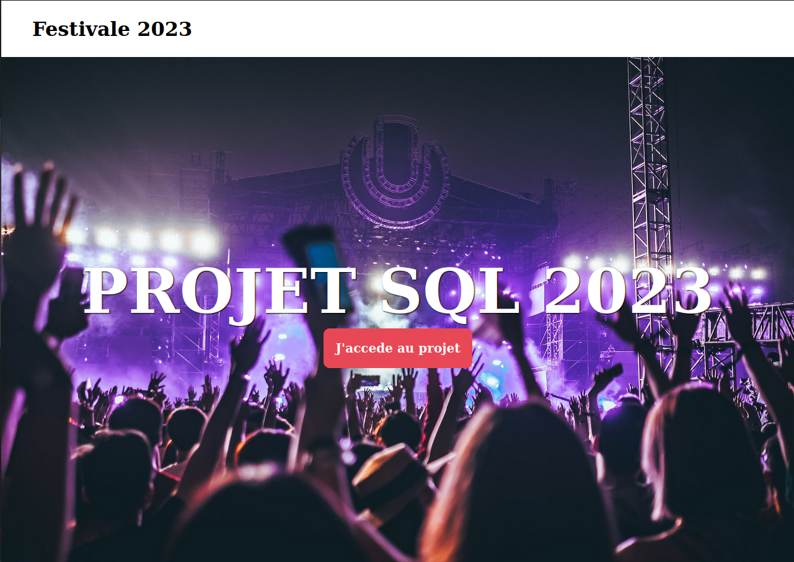
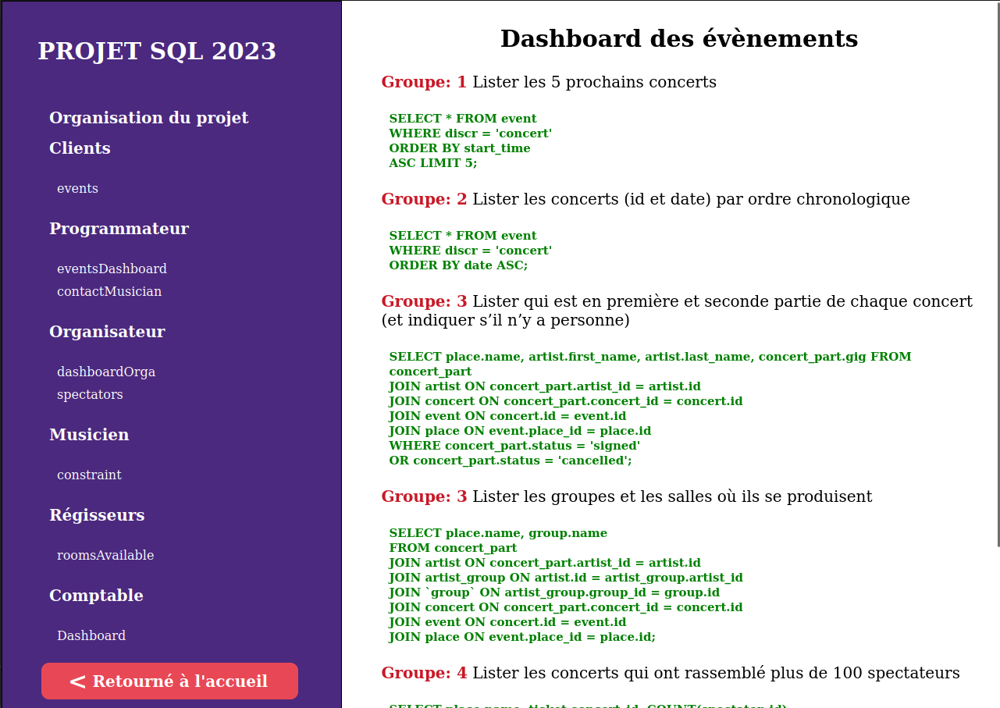

# PROJET SQL 2023 - HETIC





#


## 1. installer le fichier venv

linux:

```shell
 python3 -m venv venv
```

windows:

```shell
 py -3 -m venv venv
```

## 2. Activer l'environnement

linux:

```shell
 . venv/bin/activate
```

windows:

```shell
 venv\Scripts\activate
```

## 3. Installer les dépendances

```shell
pip install Flask
```

## 4. Lancer l'application

```shell
flask --app main run --debug
```
